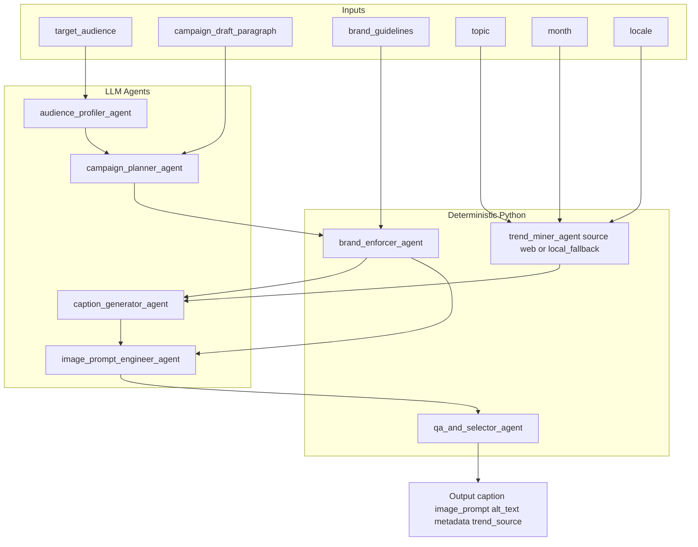
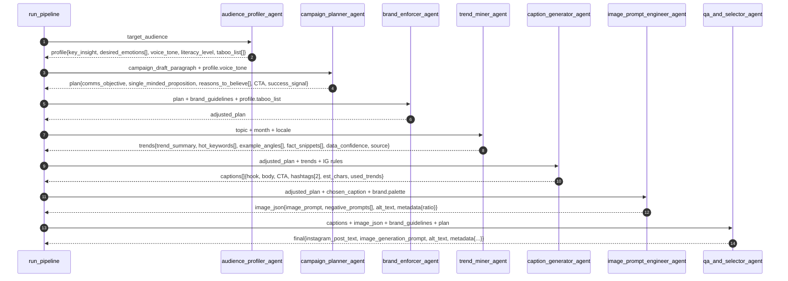

# Marketing Campaign Assistant

AI-powered assistant that turns a campaign idea into Instagram-ready content: one polished caption + one cinematic AI image prompt.

[](https://python.org)
[](https://ollama.com)

## 🎯 What It Does

You give it:
- a target audience (dict)
- a draft idea paragraph

It runs a minimal chain of single-purpose agents (profile → plan → brand-enforce → trends → caption → image-prompt → QA) and returns:
- Instagram caption text (hook, body, soft CTA, exactly 2 hashtags)
- AI image prompt (with negatives + alt text)
- Metadata (objective/KPI, trend source)
- Token usage and per-agent timing printed to stdout

Uses Ollama locally (default model: `phi3:mini`) for creative steps. Guardrails (brand tone, hashtag rules, taboo terms, length checks) are implemented in simple Python.

## 🌟 Key Features

#### 🧠 LLM Agents (via Ollama)

1. **audience_profiler_agent** → audience insight & tone

    Output: `key_insight`, `desired_emotions[]`, `voice_tone`, `literacy_level`, `taboo_list[]`

2. **campaign_planner_agent** → tight post strategy from idea + voice
    
    Output: `comms_objective`, `single_minded_proposition`, `reasons_to_believe[]`, `CTA`, `success_signal`

3. **caption_generator_agent** → 3–5 IG captions from plan + trends + IG rules
    
    Output: `captions[]` with `hook`, `body`, `CTA`, `hashtags[2]`, `est_chars`, `used_trends`

4. **image_prompt_engineer_agent** → cinematic image prompt + alt text
    
    Output: `image_prompt`, `negative_prompts[]`, `alt_text`, `metadata{ratio}`.

#### 🧰 Deterministic Agents (pure Python)

5. **brand_enforcer_agent** → applies brand tone / fixes disallowed CTA

6. **trend_miner_agent** → stub (static football trends). Optional “live trends” tool below. **Tags source:** `"web"` (scraper) or `"local_fallback"` (static).

7. **qa_and_selector_agent** → validates captions, picks the best, assembles final post

#### 🔌 Infrastructure

- **ask_ollama:** resilient helper that tries `/api/chat` (non-streamed) and falls back to `/api/generate`, accumulates token counts (`prompt_eval_count`, `eval_count`).
- **time_step:** prints START/END timestamps, duration, and tokens per agent.

## 🚀 Quick Start

#### 1. Prerequisites

  Mandatory:
  - Python 3.10+
  - [Ollama](https://ollama.com/) installed and running
  - Model pulled: `phi3:mini`

  ```bash
  # Install Ollama (Homebrew)
  brew install ollama
  brew services start ollama

  # Pull model
  ollama pull phi3:mini

  # Python deps (only 'requests')
  python3 -m pip install -U requests
  ```

  Optional - only if you want to run it via streamlit app:
  - Streamlit installed

  ```bash
  # Install streamlit
  python3 -m pip install -U streamlit requests
  ```

#### 2. Run

  <ins>**2.1. Run python script directly**<ins>

  ```bash
  # optional: override model/host
  export OLLAMA_MODEL="phi3:mini"
  export OLLAMA_HOST="http://127.0.0.1:11434"

  python3 main.py
  ```

  You’ll see per-agent timing like:
  ```bash
  ▶ audience_profiler_agent START 2025-10-19T12:23:10
  ✓ audience_profiler_agent END   2025-10-19T12:23:11  (0.78s)  tokens in/out: 123/45
  ...
  Token usage — input: 456, output: 189
  ```

  **Output fields** (printed as JSON):
  - `instagram_post_text`
  - `image_generation_prompt`
  - `alt_text`
  - `metadata`

  Example full output:
  ```bash
  ▶ audience_profiler_agent START 2025-10-19T15:47:58
  ✓ audience_profiler_agent END   2025-10-19T15:48:03  (4.78s)  tokens in/out: 139/101
  ▶ campaign_planner_agent START 2025-10-19T15:48:03
  ✓ campaign_planner_agent END   2025-10-19T15:48:11  (8.10s)  tokens in/out: 144/182
  ▶ brand_enforcer_agent START 2025-10-19T15:48:11
  ✓ brand_enforcer_agent END   2025-10-19T15:48:11  (0.00s)  tokens in/out: 0/0
  ▶ trend_miner_agent START 2025-10-19T15:48:11
  ✓ trend_miner_agent END   2025-10-19T15:48:12  (0.82s)  tokens in/out: 0/0
  Trend source: web
  ▶ caption_generator_agent START 2025-10-19T15:48:12
  ✓ caption_generator_agent END   2025-10-19T15:48:39  (27.57s)  tokens in/out: 623/535
  ▶ image_prompt_engineer_agent START 2025-10-19T15:48:39
  ✓ image_prompt_engineer_agent END   2025-10-19T15:48:58  (18.86s)  tokens in/out: 518/377
  ▶ qa_and_selector_agent START 2025-10-19T15:48:58
  ✓ qa_and_selector_agent END   2025-10-19T15:48:58  (0.00s)  tokens in/out: 0/0
  {
    "instagram_post_text": "Embrace your inner adventurer with every step.\nOur Voyager Shoes are not just footwear, they're a companion for the road less traveled. Crafted from high-quality materials and featuring an innovative design that provides superior grip on various terrains ensuring safety during your explorations.\n\nJoin thousands who have already discovered their perfect pair at checkout.\n\nStart Your Adventure Today!\n#VoyagerShoes #EveryStepIsAnExploration",
    "image_generation_prompt": "'Voyager Explorers' - a visually striking image capturing the essence of an adventurer stepping into Voyager Shoes, exuding confidence and preparedness for exploration. The scene is set with dynamic lighting that emphasizes texture and material quality.",
    "alt_text": "'Voyager Explorers' - an empowering image that captures the spirit of adventure with every step taken in our durable and stylish Voyager Shoes, tailored for long journeys across diverse landscapes.",
    "metadata": {
      "objective": "Position Voyager Shoes as the essential footwear for explorers",
      "primary_kpi": "Join thousands who have already discovered their perfect pair at checkout.",
      "constraints_applied": true,
      "trend_source": "web"
    }
  }
  Token usage — input: 1424, output: 1195
  ```

  <ins> **2.2. Run via Streamlit App** </ins>

  This repo ships with a small UI (`app.py`) that wraps `main.py`.
  
  **Start Ollama & pull a model**
  ```bash
  brew services start ollama # or open the Ollama app
  curl -s http://127.0.0.1:11434/api/version
  ollama pull phi3:mini
  ```
  
  **Run the UI**
  ```bash
  streamlit run app.py
  ```
  - Opens http://localhost:8501  
  - Fill the form (audience, locale, month, draft) and click **Generate**  
  - You’ll get the caption, image prompt, alt text, **full metadata**, and per-agent timing + token totals
  
  **Switch model/host**
  - Use the Streamlit sidebar, or launch with env vars:
  ```bash
  export OLLAMA_MODEL="phi3:mini"
  export OLLAMA_HOST="http://127.0.0.1:11434"
  streamlit run app.py
  ```
  
  **Change port (optional)**
  ```bash
  streamlit run app.py --server.port 8502
  ```

## 🧩 Configuration
- Model: `OLLAMA_MODEL` env var (default `phi3:mini`)
- Host/Port: `OLLAMA_HOST` env var (default `http://127.0.0.1:11434`)
- Brand guidelines: optional `brand_guidelines.json` in the same folder. If absent, code uses a Voyager Shoes default (tone, palette, hashtags, taboo terms).

## 📖 How It Works (Pipeline)

1. **Audience Profiler** → extracts tone & taboos
2. **Campaign Planner** → single-minded proposition + CTA
3. **Brand Enforcer** → pads in voice tone, fixes hard-sell CTA
4. **Trend Miner** → stub football trend hints (see “Live Trends” below)
5. **Caption Generator** → multiple candidates, normalized (hashtags always present)
6. **Image Prompt Engineer** → one cinematic prompt + negatives + alt text
7. **QA & Selector** → rules: hook < 125, total < 2200, exact 2 hashtags (brand + one theme), no taboo terms → pick best



**Sequence Flow:**

## 📰 (Optional) Live Trends Tool

The code ships with a static trend_miner_agent. To enable live-ish trends:

Add this “tool” above the agents and replace trend_miner_agent accordingly.
It scrapes a couple of RSS feeds + Google News search and returns keywords/titles.

```python
# --- Simple web "tool" for trends (place above agents) ---
def trend_scraper_tool(topic: str, month: str, locale: str) -> dict:
    import re, collections, requests
    cc = (locale.split("-")[-1] or "GB").upper()
    ll = (locale.split("-")[0] or "en").lower()
    feeds = [
        f"https://news.google.com/rss/search?q={requests.utils.quote(topic + ' ' + month)}&hl={ll}-{cc}&gl={cc}&ceid={cc}:{ll}",
        "https://feeds.bbci.co.uk/sport/football/rss.xml",
        "https://www.theguardian.com/football/rss",
    ]
    titles = []
    for url in feeds:
        try:
            r = requests.get(url, timeout=8, headers={"User-Agent":"Mozilla/5.0"})
            if r.ok:
                titles += re.findall(r"<title>(.*?)</title>", r.text, flags=re.I)
        except Exception:
            pass
    titles = [t for t in titles if len(t.split()) > 3]
    titles = list(dict.fromkeys(titles))[:50]
    text = " ".join(titles).lower()
    words = re.findall(r"[a-z]{3,}", text)
    stop = set("the and for with from this that into your have has are was were will live latest update updates vs cup league premier fa uefa match game games sport sports football".split())
    words = [w for w in words if w not in stop]
    hot = [w for w,_ in collections.Counter(words).most_common(10)]
    return {
        "trend_summary": ", ".join(hot[:5]) if hot else "no strong signals",
        "hot_keywords": hot,
        "example_angles": [f"{w} — pre-match ritual" for w in hot[:3]] or ["golden-hour match prep"],
        "fact_snippets": titles[:3],
        "data_confidence": "medium" if len(titles) >= 10 else "low",
        "source": "web"
    }

# --- Replace the stub function with this ---
def trend_miner_agent(topic: str, month: str, locale: str) -> dict:
    try:
        data = trend_scraper_tool(topic, month, locale)
        if data.get("hot_keywords"):
          data.setdefault("source", "web")
          return data
    except Exception:
        pass
    return {
        "trend_summary":"Derby chatter, stoppage-time drama, pre-match rituals.",
        "hot_keywords":["derby day","stoppage time"],
        "example_angles":["golden-hour match prep"],
        "fact_snippets":[f"{month} {locale}"],
        "data_confidence":"low",
        "source":"local_fallback"
    }
```

**Note:** Keep it simple. If your network blocks RSS, the function gracefully falls back to the static data.

## 🛡️ Security & Privacy

- LLM calls are local via Ollama.
- If you enable the Live Trends tool, it performs read-only HTTP GETs to public RSS/News endpoints.

## 🔍 Troubleshooting

- **404** `/api/chat`
  Your Ollama build may not expose the chat route. The code already falls back to `/api/generate`.
  Verify the API is up:
  ```bash
  curl -s http://127.0.0.1:11434/api/version
  ```
- **Model not found**
  Pull it and list:
  ```bash
  ollama pull phi3:mini
  ollama list
  ```
- **JSON errors / missing fields from the model**
  Code normalizes captions and has safe defaults; worst case you’ll get:
  ```bash
  {"status": "needs_revision", "reason": "no passing caption"}
  ```
- Re-run, or try a slightly larger local model (e.g., `qwen2.5:7b-instruct`) via:
  ```bash
  export OLLAMA_MODEL="qwen2.5:7b-instruct"
  ```
- **Network issues for Live Trends**  
  The live tool is optional. If RSS fails, the stub fallback is used automatically.
- Missing Streamlit
  ```bash
  python3 -m pip install -U streamlit`
  ```

## 🤝 Contributing

This agent is part of the [AgentBuild.ai Agents Collection](https://github.com/agentbuild-ai/agents). 

To contribute:
1. Fork the main repository
2. Create a feature branch
3. Make your changes in the `circle-voyager-marketing-campaign-assistant/` directory
4. Submit a pull request

## 📄 License

This project is licensed under the MIT License - see the [LICENSE](LICENSE) file for details.

---

**Part of the [AgentBuild.ai Agents Collection](https://github.com/agentbuild-ai/agents) - Building the future of AI agents, one tool at a time.**
